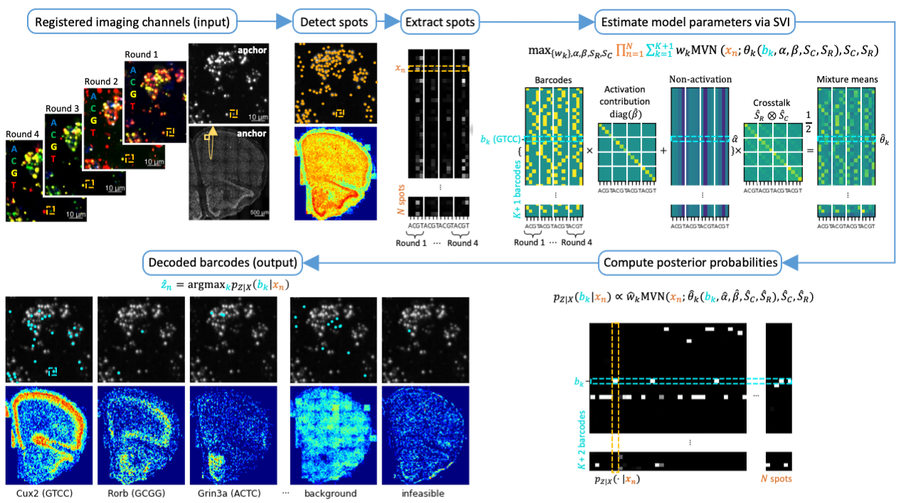

## PoSTcode



This repo provides an implementation of the **P**r**o**babilistic Image-based **S**patial **T**ranscriptomics De**code**r (PoSTcode), 
which is a method for decoding image-based spatial transcriptomics based on a re-parametrised matrix-variate Gaussian mixture model,
implemented using stochastic variational inference in [pyro](https://pyro.ai/). 
<!The method implemented here is described in the paper ["PoSTcode: Probabilistic image-based spatial transcriptomics decoder"]().
>

To get started, please explore the Jupyter Notebook
[example_iss_tile.ipynb](notebooks/example_iss_tile.ipynb), which provides an
example of how the code can be used to decode an [ISS tile](example-iss-tile-data) from the
mouse brain dataset stored locally.

The code has been tested with python 3.6.12 and its requirements can be
fulfilled by running
```
python3 -m pip install -r requirements.txt
python3 -m pip install -e .
```

The code is written by Milana Gataric (milanagataric at gmail.com). 
If you use this code, please cite the original paper where it was introduced:
[PoSTcode: Probabilistic image-based spatial transcriptomics decoder]().
